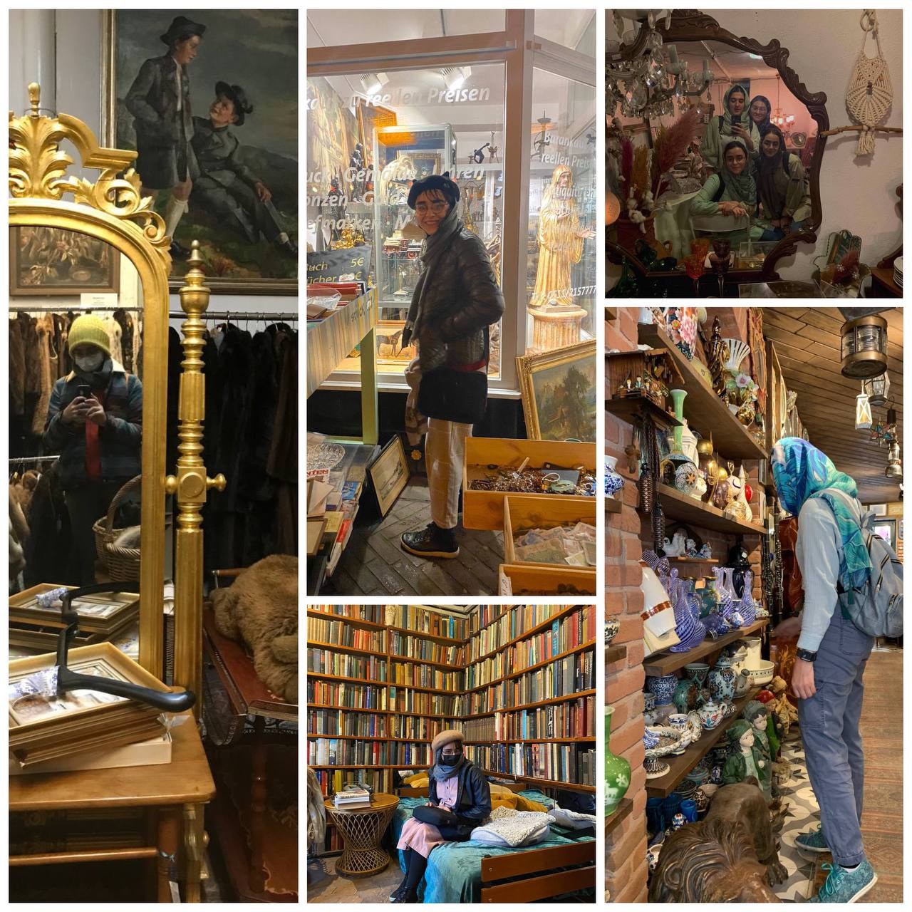
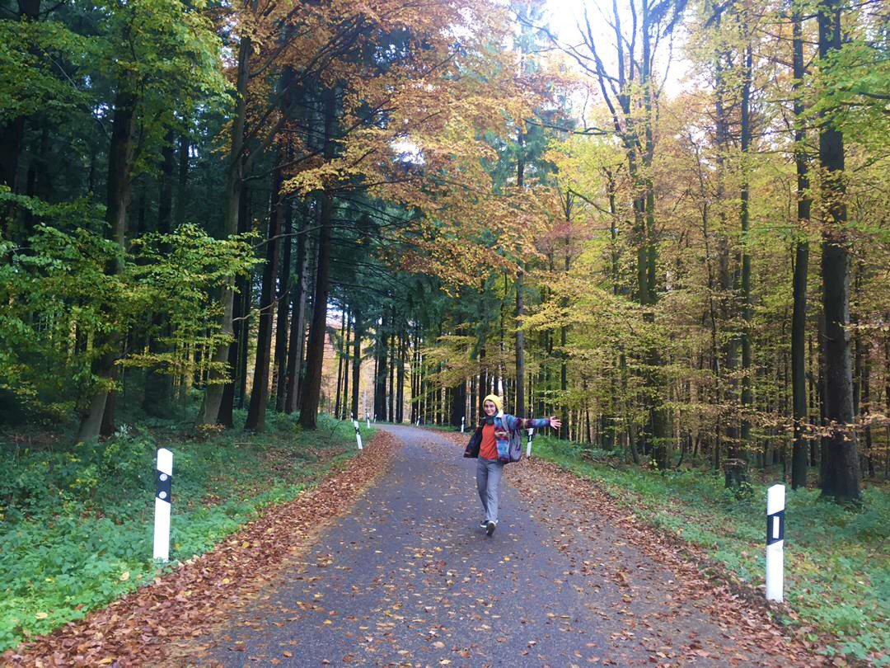
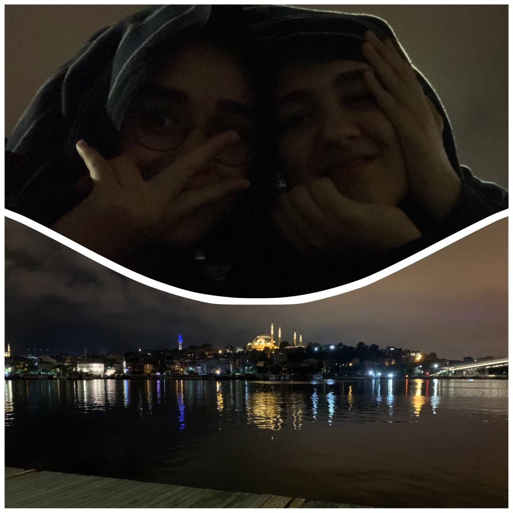
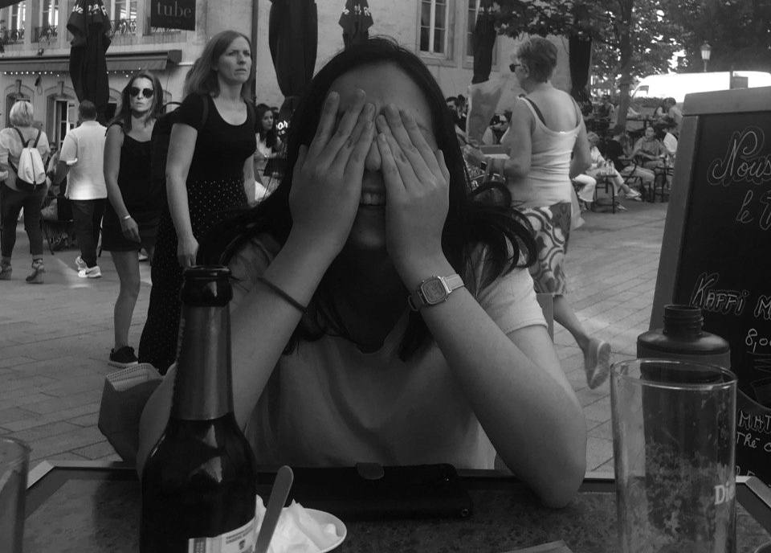

 

<h1 align="center"> 
 Woah! What a wonderful world! 
 </h1>

I explore the sky while working, and in my spare time, I search for what is left undiscovered for me from feelings and experiences on the Earth!

I love to explore new places and randomly walk or bike around cities to find antique bookstores, random treasures in old forgotten stores, or a beautiful silent spot to sit and read and watch the sunset. 

[Sunset on Heidelberg castle.]()

{width=250}
The happy me in the haunt of old treasures in Tehran, Istanbul, Paris, Frankfurt and Hannover!

I also extremely enjoy making lists of everything I like. I make thousands of playlists for the sound of all the places I've been walking in.
On the freezing or scorching days (Which actually is quite common in Iranian summers), I like to sit inside with good music and a good book or a poet and an occasional (non-alcoholic) drink or start a random in-door hobby. So far, I have tried playing piano, painting, Vitra (glass painting), yoga, embroidery, and making salty cookies. (Let me just point out that I'm not a professional or even good in any of these:-") 

I sometimes write short reviews in English and Persian on the books I read, which you can find on my Goodreads.
Also, find my public playlists on my Spotify.

 
 
 

Besides, I quite enjoy debating all the life questions over a cup of coffee or tea or on a long hike! So reach me out if you like to chat ;)

*Check out my lists ;)*

1- [Come and get lost with me in ...]()

2- [My Museums]()

3- [All my homes]()

4- [My most moving books]()

5- ...

*Also, check Out my World's map!*

# Album

Me in the middle of a breathtaking argument with another friend on "What does it mean to love your country?" while walking in Konigstuhl forests!

Another long night of talking about everything and nothing till the sun rises with my friend Sahar =))

This is my friend Domenica on a hot afternoon in Luxembourg while talking about the problems of capitalism for over 5 hours in a Luxembourgian cafe. 

One of the most memorable nights of my university, reading poems outside the dormitory building.

<h1 align="center"> 
 Ultimate goal: Yet to be found! 
 </h1>

